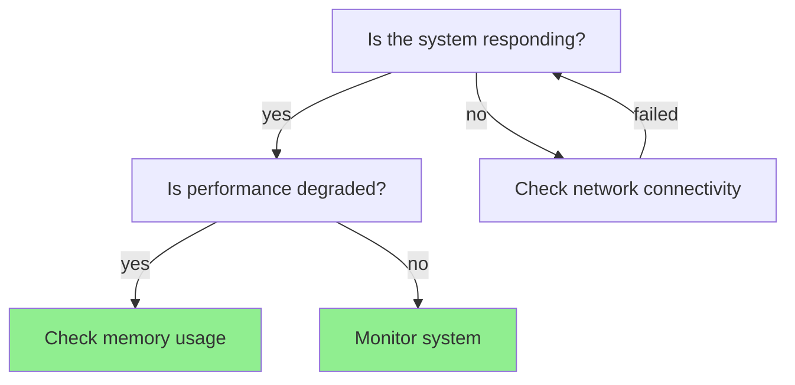

# DecisionTreeTool Functionality Guide

*The Swiss Army Knife of Decision Making* 🌳
*Like a family tree, but for your problems*

**Warning: May cause sudden clarity and knowing what to do next**

## What This Beast Can Do

DecisionTreeTool is basically a GPS for your brain 🧠 - it helps you navigate through life's complicated decisions without getting lost in a maze of "what-ifs" and "maybes." It's designed to work with both Claude Code (via MCP) and Amazon Q (via CLI) because, let's face it, we don't discriminate against AI assistants. They're all good bots, Brent.

## Core Features (The Good Stuff)

### 🌳 Decision Tree Management
- **Create Trees**: Plant seeds of wisdom from scratch (with fancy names because everything sounds better with fancy names)
- **Add Nodes**: Create condition nodes (the "what if?" crowd) and action nodes (the "let's do something!" types)
- **Link Nodes**: Play matchmaker between nodes - building relationships that actually work
- **Traverse Trees**: Navigate decision paths like a GPS that doesn't tell you to drive into a lake
- **Cycle Detection**: Handle loops and infinite recursion without having an existential crisis

### 📁 Project Organization (Marie Kondo for Decision Trees)
- **Auto-Detection**: Psychic powers activated - automatically knows which project you're working on
- **Project-Specific Storage**: Organizes trees by project because chaos is not a filing system
- **Pre-configured Projects** (The usual suspects):
  - `project1` - Main project decision trees for core operations
  - `project2` - Secondary project for automation workflows
  - `integration` - Where different tools and systems come to play nice together
  - `DecisionTreeTool` - Meta-trees for the framework itself (turtles all the way down)
  - `general` - The junk drawer of decision trees

### 📊 Export Formats (More Flavors Than Baskin-Robbins)
- **JSON**: The lingua franca of APIs - because everything speaks JSON these days
- **YAML**: For humans who think angle brackets are aggressive
- **ASCII**: Old school terminal art that makes you feel like a 90s hacker 🎨
- **Mermaid**: Making flowcharts sexy again (yes, that's a thing)
- **DOT**: For Graphviz nerds who understand graph theory and aren't afraid to use it

### 🤖 AI Integration (Teaching Robots to Make Decisions)

#### Claude Desktop (MCP)
- Full MCP protocol integration (fancy talk for "it just works")
- Natural language tree building (tell Claude what you want, get a tree)
- Interactive decision tree creation (like having a conversation with your computer)
- Visual output in Claude interface (pretty pictures for pretty decisions)

#### Amazon Q (CLI)
- Command-line interface for shell warriors
- Scriptable decision tree operations (automation that doesn't break)
- File-based persistence (saves your work like a responsible adult)
- Integration with Q's command execution (plays well with others)

## Command Reference (Your New Best Friends)

### Basic Commands (The Essentials)

```bash
# Create a new decision tree (birth certificate for your decisions)
python3 manage_decision_tree.py create --name "My Decision Tree" --description "Helps with decisions"

# Add nodes to the tree (building the family)
python3 manage_decision_tree.py add --question "Is the server running?" --type condition
python3 manage_decision_tree.py add --question "Restart server" --type action --action "sudo systemctl restart nginx"

# Link nodes together (playing matchmaker)
python3 manage_decision_tree.py link --parent node1 --child node2 --answer "yes"

# Export in different formats (sharing is caring)
python3 manage_decision_tree.py export --format ascii        # Terminal art
python3 manage_decision_tree.py export --format json --file my_tree.json  # Data format
python3 manage_decision_tree.py export --format mermaid --project project1  # Pretty diagrams
```

### Project Management (Organization That Actually Works)

```bash
# List all available projects (survey the kingdom)
python3 manage_decision_tree.py list-projects

# Switch to a specific project (change your focus)
python3 manage_decision_tree.py set-project project1

# List trees in current project (inventory check)
python3 manage_decision_tree.py list

# Load a previously saved tree (resurrection magic)
python3 manage_decision_tree.py load --name "troubleshooting_guide" --project project2
```

### Advanced Usage (For the Power Users)

```bash
# Traverse a tree with answers (GPS for decisions)
python3 manage_decision_tree.py traverse --answers '{"Is it working?": "no", "Check logs?": "yes"}'

# Switch between active trees in memory (context switching like a pro)
python3 manage_decision_tree.py switch --tree-id abc123
```

## File Organization

```
DecisionTreeTool/
├── manage_decision_tree.py          # Main CLI entry point
├── src/DecisionTreeTool/            # Core functionality
│   ├── decision_tree_tool.py        # Main implementation
│   ├── project_context.py           # Project management
│   ├── decision_tree_robust.py      # Advanced tree features
│   └── decision_tree_mcp.py         # MCP server integration
├── decision_trees/                  # Project-organized storage
│   ├── DecisionTreeTool/           # Framework development trees
│   ├── project1/                   # Main project trees
│   ├── project2/                   # Secondary project trees
│   ├── integration/                # Integration workflow trees
│   └── general/                    # General purpose trees
└── examples/                       # Demo scripts and samples
```

## Programming API

### Basic Usage

```python
from src.DecisionTreeTool.decision_tree_tool import DecisionTree, DecisionNode

# Create a tree
tree = DecisionTree("Troubleshooting Guide", "Help debug issues")

# Add nodes
root_id = tree.add_node("Is the system responding?", "condition")
action_id = tree.add_node("Check system status", "action", "systemctl status myapp")

# Link nodes
tree.add_child(root_id, "no", action_id)

# Export
from src.DecisionTreeTool.decision_tree_tool import DecisionTreeExporter
ascii_tree = DecisionTreeExporter.to_ascii(tree)
print(ascii_tree)
```

### Project-Aware Usage

```python
from src.DecisionTreeTool.decision_tree_tool import DecisionTreeCLI

cli = DecisionTreeCLI()
print(f"Current project: {cli.current_project}")  # Auto-detected

# Create and save to project
cli.create_tree("My Tree", "Description")
result = cli.export_tree("json", project_name="project1")
print(result)  # Shows project-specific path

# Load from project
cli.load_tree("my_tree", "project1")
```

## Visual Output Examples

### ASCII Tree Output
```
🌳 System Troubleshooting Guide
   Systematic approach to diagnosing issues

Root: Is the system responding?
├── [yes] Is performance degraded?
│   ├── [yes] Check memory usage → Monitor system resources
│   └── [no] Monitor system → Continue normal operation
└── [no] Check network connectivity
    └── [failed] 🔄 → loops back to: Is the system responding?

Legend: 🔄 = cycle/loop back to earlier node
```

### Mermaid Diagram


## Integration Examples

### Claude Integration
```
User: "Create a decision tree for handling customer support tickets"

Claude: I'll create a customer support decision tree for you.

[Uses decision_tree tool with action: "create", tree_name: "Customer Support Triage"]

Now I'll add the decision nodes...

[Uses decision_tree tool to add nodes for ticket priority, issue type, etc.]
```

### Amazon Q Integration
```bash
Q> Run: python3 manage_decision_tree.py create --name "Deployment Checklist" --description "Pre-deployment validation steps"

Q> Run: python3 manage_decision_tree.py add --question "Are all tests passing?" --type condition

Q> Run: python3 manage_decision_tree.py export --format ascii
```

## Advanced Features

### Cycle Detection
- Prevents infinite recursion in tree traversal
- Shows clear indicators when paths loop back
- Handles complex workflow patterns safely

### Project Context
- Automatically detects working directory context
- Organizes trees by project for better management
- Supports custom project definitions

### Multiple Export Formats
- ASCII for terminal display
- Mermaid for documentation
- DOT for professional diagrams
- JSON/YAML for data interchange

### Confidence Scoring
- Track decision quality through paths
- Metadata support for additional context
- Extensible node properties

## Use Cases

### Development Workflow
- Feature planning decision trees
- Code review checklists
- Deployment validation flows
- Troubleshooting guides

### Operations
- Incident response procedures
- System monitoring decisions
- Alert triage workflows
- Capacity planning decisions

### Business Logic
- Customer support routing
- Product recommendation flows
- Approval workflows
- Risk assessment trees

### AI Assistant Integration
- Structured reasoning for LLMs
- Automated decision execution
- Knowledge base organization
- Interactive problem solving

## Requirements

**Minimal Installation:**
- Python 3.7+
- `manage_decision_tree.py` (279 bytes)
- `src/DecisionTreeTool/` directory (~60KB)

**Optional Dependencies:**
- `yaml` library for YAML export
- `pathlib` for file operations (included in Python 3.4+)

**Total Size:** ~60KB for full functionality

## Getting Started

1. **Quick Test:**
   ```bash
   python3 manage_decision_tree.py list-projects
   python3 manage_decision_tree.py create --name "Test Tree"
   python3 manage_decision_tree.py export --format ascii
   ```

2. **Create Your First Tree:**
   ```bash
   python3 manage_decision_tree.py create --name "Morning Routine" --description "Optimize daily startup"
   python3 manage_decision_tree.py add --question "Is it a weekday?"
   python3 manage_decision_tree.py add --question "Go to work" --type action --action "Commute to office"
   python3 manage_decision_tree.py add --question "Enjoy weekend" --type action --action "Relax and recharge"
   ```

3. **Save and Load:**
   ```bash
   python3 manage_decision_tree.py export --format json
   python3 manage_decision_tree.py load --name "morning_routine"
   ```

## Contributing

The DecisionTreeTool includes its own decision trees for development:
- `development_workflow` - Guide for adding features
- `user_support_guide` - Help troubleshoot user issues
- `feature_planning` - Prioritize new enhancements

Load these for guidance:
```bash
python3 manage_decision_tree.py load --name "development_workflow"
python3 manage_decision_tree.py export --format ascii
```

---

*"Like a family tree, but for your problems"* 🌳
