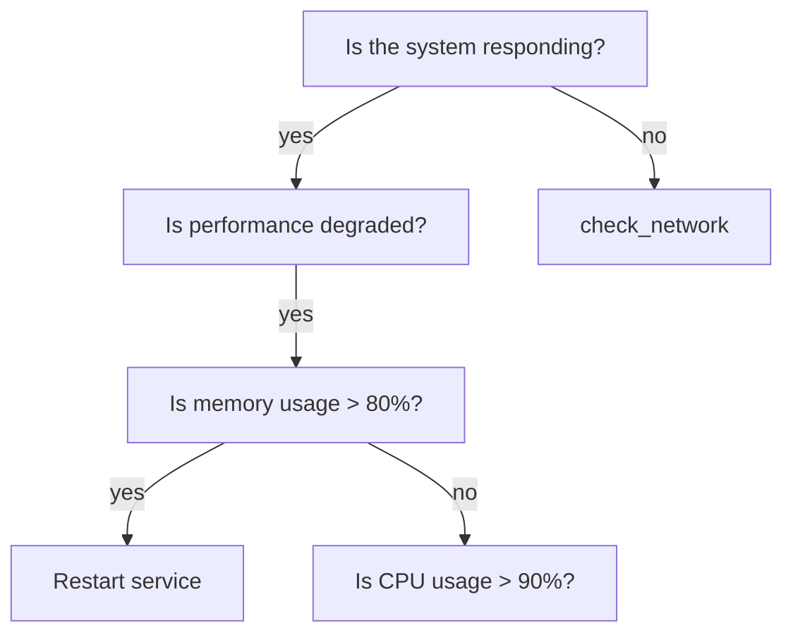

# Decision Tree Tool
*Like a family tree, but for your problems*

**Warning: May cause sudden clarity**

**Side effects include: knowing what to do next**

Turn your "I have no idea what to do" moments into structured decision-making with visual trees that map out your options. Because sometimes you need to see all your choices laid out before you can pick the least terrible one.

## What it does
- Maps complex decisions into clear, branching paths
- Helps you visualize consequences and outcomes
- Turns overwhelming choices into manageable steps
- Makes you look like you actually have your life together

## What it doesn't do
- Make decisions for you (that's still your job)
- Guarantee good outcomes (we're tools, not fortune tellers)
- Fix your commitment issues (therapy not included)

---

A robust decision tree framework for systematic problem-solving, root cause analysis, and AI-assisted debugging. Features confidence scoring, fallback logic, and MCP integration for use with AI assistants.

## Structure

```
DecisionTreeTool/
├── brazil.ion          # Brazil package configuration
├── Config             # Brazil build configuration
├── setup.py           # Python package setup
├── src/               # Source code
│   └── DecisionTreeTool/ # Main package
├── test/              # Unit tests
├── bin/               # Executable scripts
├── lib/               # Libraries
├── docs/              # Documentation
└── build/             # Build artifacts (generated)
```

## Building

```bash
brazil-build
```

## Testing

```bash
brazil-build test
```

## Development Setup

```bash
# Create virtual environment
python3 -m venv venv
source venv/bin/activate

# Install in development mode
pip install -e .
pip install -e .[dev]
```

## Features

### 🎯 Core Capabilities
- **Robust Decision Trees**: Navigate complex decision paths with fallback logic
- **Confidence Scoring**: Track decision quality through the entire path
- **Context Validation**: Ensure required data exists before proceeding
- **AI Assistant Integration**: Works with Claude (via MCP) and Amazon Q (via CLI)
- **Multiple Export Formats**: JSON, YAML, Mermaid diagrams, Graphviz DOT, ASCII
- **YAML/JSON Support**: Define trees in human-readable formats

### 📊 Visual Output Examples

#### ASCII Tree (Terminal Display)
```
🌳 System Troubleshooting Guide
   Systematic approach to diagnosing system issues

Root: Is the system responding?
├── [yes] Is performance degraded?
│   ├── [yes] Is memory usage > 80%?
│   │   ├── [yes] Restart service → sudo systemctl restart app-service
│   │   └── [no] Is CPU usage > 90%?
│   │       ├── [yes] Optimize database queries → Run query optimization
│   │       └── [no] Monitor system → Enable detailed monitoring
│   └── [no] Monitor system → Enable detailed monitoring for 1 hour
└── [no] Can you ping the server?
    ├── [yes] Is the service running?
    │   ├── [no] Start the service → sudo systemctl start app-service
    │   └── [yes] Check error logs → tail -n 100 /var/log/app/error.log
    └── [no] Escalate to network team → Create ticket with diagnostics
```

#### Mermaid Diagram (Rendered)


### 🤖 AI Assistant Integration
- **Claude Desktop**: Full MCP integration for natural language interaction
- **Amazon Q**: CLI-based integration for command execution
- **Extensible**: Easy to integrate with other AI tools

### 🛡️ Robustness Features
- **Fallback Logic**: Never hit dead ends - always have a default path
- **Minimum Confidence Thresholds**: Prevent low-quality decisions
- **Context Requirements**: Validate required data before each step
- **Weight-based Importance**: Prioritize critical decision nodes

## Quick Start

### 1. Basic Usage

```bash
# Create a new decision tree
python3 manage_decision_tree.py create "Debug Tree"

# Add decision points
python3 manage_decision_tree.py add --question "Is the server responding?"

# Link decisions together
python3 manage_decision_tree.py link --parent node1 --child node2 --answer "yes"

# See your tree visually
python3 manage_decision_tree.py export --format ascii

# Save your tree
python3 manage_decision_tree.py export --format json --file my_tree.json
```

### 2. Common Commands

| What you want to do | Command |
|-------------------|---------|
| Create a new tree | `python3 manage_decision_tree.py create "My Tree"` |
| Add a question | `python3 manage_decision_tree.py add --question "Is it working?"` |
| Add an action | `python3 manage_decision_tree.py add --question "Restart" --type action --action "sudo restart"` |
| Connect nodes | `python3 manage_decision_tree.py link --parent node1 --child node2 --answer "yes"` |
| View your tree | `python3 manage_decision_tree.py export --format ascii` |
| Save as JSON | `python3 manage_decision_tree.py export --format json --file tree.json` |
| Save as diagram | `python3 manage_decision_tree.py export --format mermaid --file tree.mmd` |
| List all trees | `python3 manage_decision_tree.py list` |

### 3. Step-by-Step Example

```bash
# Step 1: Create your tree
python3 manage_decision_tree.py create "Server Troubleshooting"

# Step 2: Add questions and actions
python3 manage_decision_tree.py add --question "Is the server running?"
python3 manage_decision_tree.py add --question "Check the logs" --type action --action "tail -f /var/log/server.log"
python3 manage_decision_tree.py add --question "Start the server" --type action --action "sudo systemctl start server"

# Step 3: Connect them (you'll need the node IDs from step 2)
python3 manage_decision_tree.py link --parent abc123 --child def456 --answer "no"

# Step 4: View your tree
python3 manage_decision_tree.py export --format ascii

# Step 5: Save it
python3 manage_decision_tree.py export --format json --file troubleshooting.json
```

### 4. How to Write Good Questions and Actions

**For Questions (decision points):**
- Keep them simple: "Is the server running?" not "Can you verify the operational status of the server instance?"
- Make them yes/no when possible: "Is memory usage > 80%?"
- Be specific: "Can you ping 8.8.8.8?" instead of "Is network working?"

**For Actions (what to do):**
- Start with a verb: "Check logs", "Restart service", "Contact team"
- Include the actual command: `--action "sudo systemctl restart nginx"`
- Be clear about the outcome: "Send alert to on-call team"

**Example prompts that work well:**

```bash
# Good decision questions
python3 manage_decision_tree.py add --question "Is CPU usage above 90%?"
python3 manage_decision_tree.py add --question "Can you access the database?"
python3 manage_decision_tree.py add --question "Are there errors in the last 10 minutes?"

# Good action steps  
python3 manage_decision_tree.py add --question "Restart the web server" --type action --action "sudo systemctl restart apache2"
python3 manage_decision_tree.py add --question "Check disk space" --type action --action "df -h"
python3 manage_decision_tree.py add --question "Page the on-call engineer" --type action --action "Send alert via PagerDuty"

# Good answer labels for linking
python3 manage_decision_tree.py link --parent node1 --child node2 --answer "yes"
python3 manage_decision_tree.py link --parent node1 --child node3 --answer "no" 
python3 manage_decision_tree.py link --parent node2 --child node4 --answer "high"
python3 manage_decision_tree.py link --parent node2 --child node5 --answer "normal"
```

### Python API Usage

```python
from DecisionTreeTool.decision_tree_robust import DecisionTree, DecisionNode

# Create a simple decision tree
tree = DecisionTree(name="troubleshooting")

# Add nodes with fallback logic
tree.add_node(DecisionNode(
    id="start",
    question="Is the system responding?",
    children={
        "yes": "check_performance",
        "no": "check_connection"
    },
    fallback_node="escalate",
    min_confidence=0.7
))

# Execute with context
context = {"system": "production", "alert_type": "timeout"}
result = tree.execute(context=context)
print(f"Decision path: {result.path}")
print(f"Confidence: {result.confidence}")
print(f"Action: {result.action}")
```

### Creating Decision Trees in YAML

```yaml
name: incident_response
description: Automated incident response decision tree
metadata:
  version: "1.0"
  author: "SRE Team"

nodes:
  start:
    question: "What is the alert severity?"
    children:
      critical: "immediate_response"
      high: "check_impact"
      medium: "schedule_review"
      low: "log_and_monitor"
    fallback_node: "check_impact"
    min_confidence: 0.8

  check_impact:
    question: "Are customers impacted?"
    required_context: ["customer_metrics", "error_rate"]
    children:
      yes: "page_oncall"
      no: "automated_remediation"
      unknown: "gather_metrics"
    weight: 2.0  # Double importance

  immediate_response:
    action: "Page on-call engineer and create incident channel"
    confidence_adjustment: -0.1  # Reduce confidence for critical paths
```

### MCP Server Usage

```bash
# Start the MCP server for AI assistant integration
python -m DecisionTreeTool.decision_tree_mcp

# The server exposes tools for:
# - Loading decision trees
# - Executing decisions with context
# - Getting recommendations
# - Tracking decision history
```

### Advanced Features

```python
# Context validation
node = DecisionNode(
    id="verify_data",
    question="Is the data valid?",
    required_context=["data_source", "timestamp"],
    context_validators={
        "timestamp": "lambda x: x > time.time() - 3600"  # Less than 1 hour old
    }
)

# Confidence scoring
result = tree.execute(context, track_confidence=True)
if result.confidence < 0.5:
    print("Low confidence decision - manual review recommended")

# Path history
for step in result.path_history:
    print(f"{step.node_id}: {step.answer} (confidence: {step.confidence})")
```

## Use Cases

- **Incident Response**: Systematic troubleshooting with fallback escalation
- **Root Cause Analysis**: Navigate complex debugging scenarios
- **Automated Remediation**: Execute actions based on conditions
- **Knowledge Capture**: Document expert decision-making processes
- **AI Assistant Integration**: Provide structured reasoning for LLMs

## Testing

```bash
# Run all tests
brazil-build test

# Run specific test
python -m pytest test/test_decision_tree.py

# With coverage
python -m pytest --cov=DecisionTreeTool test/
```
