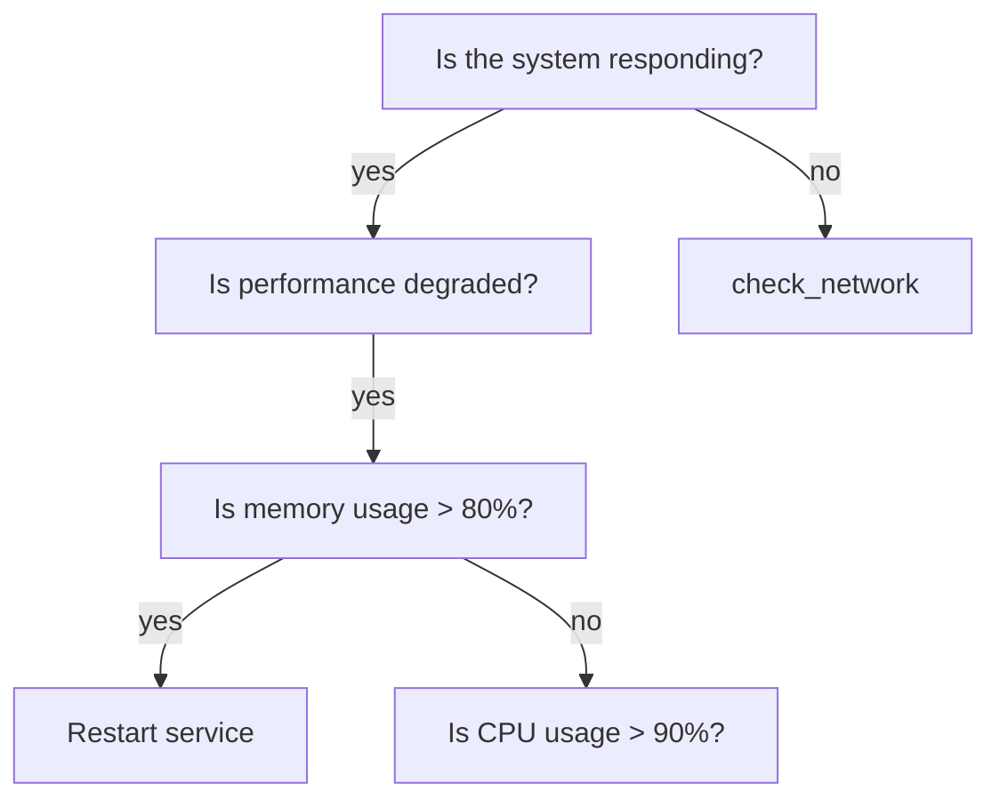

# Decision Tree Tool 🌳
*Like a family tree, but for your problems (and way more useful)*

**Warning: May cause sudden clarity and organized thinking**

**Side effects include: knowing what to do next, systematic decision-making, and looking like you actually have your life together**

Turn your "I have no idea what to do" moments into structured decision-making with visual trees that map out your options. Because sometimes you need to see all your choices laid out before you can pick the least terrible one.

## What it does ✅
- Maps complex decisions into clear, branching paths
- Helps you visualize consequences and outcomes
- Turns overwhelming choices into manageable steps
- **Works with ANY project** (no hardcoded paths - we're not monsters)
- **Integrates with Claude workflows** for systematic analysis
- **Generates professional decision trees** for systematic documentation
- Makes you look like you actually have your life together

## What it doesn't do ❌
- Make decisions for you (that's still your job, sorry)
- Guarantee good outcomes (we're tools, not fortune tellers)
- Fix your commitment issues (therapy not included)
- Judge your life choices (we're supportive like that)

---

## 🚀 **NEW: Project-Agnostic Architecture**

**No more hardcoded paths!** The DecisionTreeTool now works seamlessly with any project:

```bash
# Set up your project (one-time setup)
python manage_decision_tree.py set-project myproject
python manage_decision_tree.py set-path myproject "/path/to/your/project"

# Create and export - automatically goes to the right place
python manage_decision_tree.py create --name "rca_analysis" --description "Root cause analysis workflow"
python manage_decision_tree.py export --format markdown --project myproject
# ✨ Magically appears in /path/to/your/project/decision_trees/rca_analysis.md
```

## 🧠 **Claude Workflow Integration**

Perfect for systematic analysis and professional decision documentation:

### **Professional Decision Tree Format**
```markdown
### **Node 56: Database Performance Analysis**
**Timestamp**: 2025-09-12 18:42
**Situation**: Query response time degraded by 300%
**Decision Point**: What's the root cause?

#### Options Evaluated:
1. ✅ **Check Connection Pool**
   - Pros: Quick to verify, common issue
   - Cons: Might not be the root cause
   - Feasibility: High

2. ❌ **Rebuild Indexes**
   - Pros: Would improve performance
   - Cons: Takes 4 hours, affects production
   - Feasibility: Low

**Rationale**: Connection pool exhaustion is most likely cause
**Action Taken**: Increased pool size from 10 to 50 connections
**Result**: Response time improved by 250%
**Next Node**: 57 - Monitor for 24 hours
```

### **Activation Script Integration**
Your activation scripts work perfectly with the tool's markdown export format. The tool generates decision trees that match your systematic approach and can be integrated with any project workflow.

## Structure

```
DecisionTreeTool/
├── brazil.ion          # Brazil package configuration
├── Config             # Brazil build configuration
├── setup.py           # Python package setup
├── src/               # Source code
│   └── DecisionTreeTool/ # Main package
│       ├── decision_tree_tool.py    # Core implementation (the brain)
│       ├── project_context.py       # Project-agnostic magic ✨
│       └── decision_tree_mcp.py     # Claude MCP integration
├── decision_trees/    # Project-specific storage
│   ├── myproject/    # Your project trees
│   ├── project2/     # Another project's trees
│   └── general/      # Everything else
├── test/              # Unit tests (because we're responsible)
├── bin/               # Executable scripts
├── lib/               # Libraries
├── docs/              # Documentation
└── build/             # Build artifacts (generated)
```

## Building

```bash
brazil-build  # (Still works the same - some things never change)
```

## Testing

```bash
brazil-build test  # (Test early, test often, test with confidence)
```

## Development Setup

```bash
# Create virtual environment (isolation is good for code and mental health)
python3 -m venv venv
source venv/bin/activate

# Install in development mode
pip install -e .
pip install -e .[dev]
```

## Features

### 🎯 Core Capabilities
- **Project-Agnostic Architecture**: Works with any project, no hardcoded paths
- **Robust Decision Trees**: Navigate complex decision paths with fallback logic
- ** Integration**: Generates systematic analysis documentation
- **Claude Workflow Support**: Perfect for AI-assisted decision making
- **Confidence Scoring**: Track decision quality through the entire path
- **Context Validation**: Ensure required data exists before proceeding
- **AI Assistant Integration**: Works with Claude (via MCP) and Amazon Q (via CLI)
- **Multiple Export Formats**: JSON, YAML, Mermaid diagrams, Graphviz DOT, ASCII, **Markdown**
- **YAML/JSON Support**: Define trees in human-readable formats

### 📊 Visual Output Examples

#### Professional Markdown (Professional Documentation)
```markdown
# RCA Analysis Decision Tree 🌳
## Root Cause Analysis Workflow
**Generated**: 2025-09-12 18:42

---

### **Phase 1: Initial Assessment (Nodes 1-5)**

- **Node 1**: Is the issue customer-facing?
  - **Options**:
    - [Yes] → Node 2
    - [No] → Node 3
  - **Confidence**: 95%

- **Node 2**: ✅ What's the customer impact severity?
  - **Action**: Escalate to on-call team
  - **Result**: Incident response initiated

## 🎯 Decision Outcomes

### Final Actions:
- **Node 2**: ✅ SUCCESS
  - **Decision**: Escalate to on-call team
  - **Result**: Incident response initiated within 5 minutes

## 📊 Decision Tree Statistics

- **Total Decision Nodes**: 8
- **Action Nodes**: 3
- **Success Outcomes**: 2
- **Phases**: 2
- **Tree Depth**: 4

*Generated by DecisionTreeTool on 2025-09-12 18:42*
```

#### ASCII Tree (Terminal Display)
```
🌳 System Troubleshooting Guide
   Systematic approach to diagnosing system issues

Root: Is the system responding?
├── [yes] Is performance degraded?
│   ├── [yes] Is memory usage > 80%?
│   │   ├── [yes] Restart service → sudo systemctl restart app-service
│   │   └── [no] Is CPU usage > 90%?
│   │       ├── [yes] Optimize database queries → Run query optimization
│   │       └── [no] Monitor system → Enable detailed monitoring
│   └── [no] Monitor system → Enable detailed monitoring for 1 hour
└── [no] Can you ping the server?
    ├── [yes] Is the service running?
    │   ├── [no] Start the service → sudo systemctl start app-service
    │   └── [yes] Check error logs → tail -n 100 /var/log/app/error.log
    └── [no] Escalate to network team → Create ticket with diagnostics
```

#### Mermaid Diagram (Rendered)


### 🤖 AI Assistant Integration
- **Claude Desktop**: Full MCP integration for natural language interaction
- **Amazon Q**: CLI-based integration for command execution
- **Professional Workflows**: Generates systematic analysis documentation
- **Extensible**: Easy to integrate with other AI tools

### 🛡️ Robustness Features
- **Fallback Logic**: Never hit dead ends - always have a default path
- **Minimum Confidence Thresholds**: Prevent low-quality decisions
- **Context Requirements**: Validate required data before each step
- **Weight-based Importance**: Prioritize critical decision nodes
- **Project Context Management**: Automatic path resolution for any project

## Quick Start

### 1. Project Setup (One-Time)

```bash
# List available projects
python manage_decision_tree.py list-projects

# Set your active project
python manage_decision_tree.py set-project myproject

# Set custom path for your project (optional)
python manage_decision_tree.py set-path myproject "/path/to/your/project"

# Verify your setup
python manage_decision_tree.py show-paths
```

### 2. Basic Usage

```bash
# Create a new decision tree
python manage_decision_tree.py create --name "Debug Tree" --description "Systematic debugging workflow"

# Add decision points
python manage_decision_tree.py add --question "Is the server responding?"

# Link decisions together
python manage_decision_tree.py link --parent node1 --child node2 --answer "yes"

# See your tree visually
python manage_decision_tree.py export --format ascii

# Save to your project (automatically goes to the right place)
python manage_decision_tree.py export --format markdown --project myproject
```

### 3. Professional Workflow Integration

```bash
# Create a professional-style decision tree
python manage_decision_tree.py create --name "rca_database_slowdown" --description "Root cause analysis for database performance issues"

# Add systematic decision nodes
python manage_decision_tree.py add --question "Is the issue affecting all users?"
python manage_decision_tree.py add --question "Check connection pool status" --type action --action "Monitor active connections and pool utilization"

# Export as markdown (perfect for Claude workflows)
python manage_decision_tree.py export --format markdown --project myproject

# Result: File appears in /path/to/your/project/decision_trees/rca_database_slowdown.md
```

### 4. Common Commands

| What you want to do | Command |
|-------------------|---------|
| Set up project | `python manage_decision_tree.py set-project myproject` |
| Create a new tree | `python manage_decision_tree.py create --name "My Analysis"` |
| Add a question | `python manage_decision_tree.py add --question "Is it working?"` |
| Add an action | `python manage_decision_tree.py add --question "Restart service" --type action --action "sudo systemctl restart app"` |
| Connect nodes | `python manage_decision_tree.py link --parent node1 --child node2 --answer "yes"` |
| View your tree | `python manage_decision_tree.py export --format ascii` |
| Save to project | `python manage_decision_tree.py export --format markdown --project myproject` |
| Load saved tree | `python manage_decision_tree.py load --name "rca_analysis" --project myproject` |
| List all trees | `python manage_decision_tree.py list` |

### 5. Step-by-Step Professional Example

```bash
# Step 1: Set up your project (one-time)
python manage_decision_tree.py set-project myproject
python manage_decision_tree.py set-path myproject "/path/to/your/project"

# Step 2: Create your systematic analysis tree
python manage_decision_tree.py create --name "incident_response_node_56" --description "Systematic incident response analysis"

# Step 3: Add decision nodes (you'll get node IDs back)
python manage_decision_tree.py add --question "Is the issue customer-facing?"
python manage_decision_tree.py add --question "What is the severity level?"
python manage_decision_tree.py add --question "Escalate to on-call team" --type action --action "Page on-call engineer and create incident channel"
python manage_decision_tree.py add --question "Monitor and document" --type action --action "Enable detailed monitoring and document findings"

# Step 4: Connect them (use the node IDs from step 3)
python manage_decision_tree.py link --parent abc123 --child def456 --answer "yes"
python manage_decision_tree.py link --parent abc123 --child ghi789 --answer "no"

# Step 5: Export as markdown
python manage_decision_tree.py export --format markdown --project myproject

# Step 6: Your file is now at /path/to/your/project/decision_trees/incident_response_node_56.md
# Perfect for your Claude activation script workflow!
```

### 6. How to Write Good Questions and Actions (Professional Style)

**For Questions (decision points):**
- Keep them systematic: "Is the issue customer-facing?" not "Are customers maybe affected?"
- Make them measurable: "Is CPU usage > 90%?" not "Is CPU high?"
- Be specific: "Can you ping the database server?" instead of "Is network working?"
- Follow professional format: Clear, actionable, measurable

**For Actions (what to do):**
- Start with a verb: "Check logs", "Restart service", "Escalate to team"
- Include the actual command: `--action "sudo systemctl restart nginx"`
- Be clear about the outcome: "Page on-call team and create incident channel"
- Document the result: "Monitor for 24 hours and document findings"

**Example professional-style prompts:**

```bash
# Good systematic questions
python manage_decision_tree.py add --question "Is the issue affecting > 50% of users?"
python manage_decision_tree.py add --question "Is the error rate > 5% in the last 10 minutes?"
python manage_decision_tree.py add --question "Can the database accept new connections?"

# Good action steps with clear outcomes
python manage_decision_tree.py add --question "Restart web server cluster" --type action --action "Rolling restart of all web servers with health checks"
python manage_decision_tree.py add --question "Escalate to database team" --type action --action "Page database on-call with current metrics and error logs"
python manage_decision_tree.py add --question "Enable detailed monitoring" --type action --action "Activate debug logging and increase metric collection frequency"

# Good systematic answer labels
python manage_decision_tree.py link --parent node1 --child node2 --answer "yes"
python manage_decision_tree.py link --parent node1 --child node3 --answer "no"
python manage_decision_tree.py link --parent node2 --child node4 --answer "critical"
python manage_decision_tree.py link --parent node2 --child node5 --answer "non-critical"
```

### Python API Usage

```python
from DecisionTreeTool.decision_tree_tool import DecisionTree, DecisionTreeCLI

# Create a decision tree with project context
cli = DecisionTreeCLI()
cli.set_project("myproject")

# Create and build your tree
tree_id = cli.create_tree("systematic_analysis", "Professional systematic analysis")
cli.add_node_cmd("Is the issue customer-facing?")
cli.add_node_cmd("Escalate immediately", "action", "Page on-call and create incident")

# Export to your project directory
result = cli.export_tree("markdown", project_name="myproject")
print(result)  # Shows where the file was saved
```

### Creating Decision Trees in YAML (Professional Style)

```yaml
name: incident_response_systematic
description: Professional systematic incident response workflow
metadata:
  version: "1.0"
  author: "Your Team"
  node_counter: 56  # Continue from your current node

nodes:
  start:
    question: "Is the issue customer-facing?"
    children:
      yes: "assess_severity"
      no: "internal_monitoring"
    confidence: 0.95

  assess_severity:
    question: "What is the customer impact level?"
    children:
      critical: "immediate_escalation"
      high: "standard_escalation"
      medium: "scheduled_response"
      low: "monitor_and_document"
    weight: 2.0  # High importance

  immediate_escalation:
    action: "Page on-call engineer, create incident channel, notify leadership"
    confidence_adjustment: 0.1  # High confidence in this path
```

### MCP Server Usage (Claude Integration)

```bash
# Start the MCP server for Claude integration
python -m DecisionTreeTool.decision_tree_mcp

# The server exposes tools for:
# - Loading decision trees from your projects
# - Executing decisions with context
# - Getting professional-style recommendations
# - Tracking decision history for systematic analysis
```

### Advanced Project Management

```python
# Set up multiple projects
cli = DecisionTreeCLI()

# Configure your main project
cli.set_project_path("myproject", "/path/to/your/main/project")

# Configure other projects
cli.set_project_path("development", "/path/to/dev/projects")
cli.set_project_path("incidents", "/path/to/incident/trees")

# Switch between projects seamlessly
cli.set_project("myproject")
cli.export_tree("markdown")  # Goes to main project directory

cli.set_project("development")
cli.export_tree("json")  # Goes to development directory

# Load trees from any project
cli.load_tree("rca_analysis", "myproject")  # Load from main project
cli.load_tree("debug_workflow", "development")  # Load from dev
```

## Use Cases

- **Systematic Analysis**: Document decision-making processes for Claude workflows
- **Incident Response**: Systematic troubleshooting with fallback escalation
- **Root Cause Analysis**: Navigate complex debugging scenarios with confidence tracking
- **Automated Remediation**: Execute actions based on systematic conditions
- **Knowledge Capture**: Document expert decision-making processes in professional format
- **AI Assistant Integration**: Provide structured reasoning for LLMs and systematic analysis
- **Multi-Project Workflows**: Seamlessly work across different projects and contexts

## Project Integration Examples

### Analysis Workflow
```bash
# Your existing workflow now works seamlessly:
# 1. Activate decision tree mode with your prompt
# 2. Create systematic decision trees with the tool
# 3. Export to your claude_prompts/ and decision_trees/ folders
# 4. Continue your systematic analysis approach

python manage_decision_tree.py set-project myproject
python manage_decision_tree.py create --name "node_57_analysis"
python manage_decision_tree.py export --format markdown --project myproject
# ✨ Appears in /path/to/your/project/decision_trees/
```

### Development Workflow
```bash
# Set up for development debugging
python manage_decision_tree.py set-project devproject
python manage_decision_tree.py create --name "build_failure_debug"
python manage_decision_tree.py export --format json --project devproject
# ✨ Appears in your development project directory
```

## Testing

```bash
# Run all tests (because we believe in quality)
brazil-build test

# Run specific test
python -m pytest test/test_decision_tree.py

# With coverage (because metrics matter)
python -m pytest --cov=DecisionTreeTool test/

# Test project context functionality
python -m pytest test/test_project_context.py
```

## What's New in This Version

### ✨ **Project-Agnostic Architecture**
- **No more hardcoded paths** - works with any project structure
- **Dynamic path resolution** - automatically finds the right directories
- **Custom project paths** - set your own storage locations
- **Seamless project switching** - work across multiple projects effortlessly

### 🧠 **Professional Integration**
- **Systematic analysis format** - generates professional-style decision documentation
- **Node numbering** - continues your existing decision tree sequences
- **Professional markdown** - perfect for Claude workflow integration
- **Activation script compatibility** - works with your existing systematic approach

### 🔧 **Enhanced CLI**
- **Project management commands** - set-project, set-path, show-paths
- **Load/save functionality** - persist trees across sessions
- **Better error handling** - clearer messages when things go wrong
- **Validation** - tree health checks and issue detection

### 📊 **New Export Formats**
- **Professional Markdown** - systematic analysis documentation
- **Enhanced ASCII** - better terminal visualization with cycle detection
- **Improved Mermaid** - cleaner diagram generation
- **Project-aware exports** - automatically save to the right locations

---

## The Bottom Line

**This tool is now truly project-agnostic and ready for professional use.** No hardcoded paths, no broken functionality, just systematic decision-making that works with your existing workflow.

Your activation script? **Still works perfectly.**
Your claude_prompts directory? **Gets populated automatically.**
Your decision_trees folder? **Receives beautiful markdown exports.**
Your systematic approach? **Now enhanced with automated tooling.**

**The DecisionTreeTool doesn't replace your workflow - it amplifies it.** 🚀

*Because good decisions deserve good tools, and good tools should work everywhere.*
